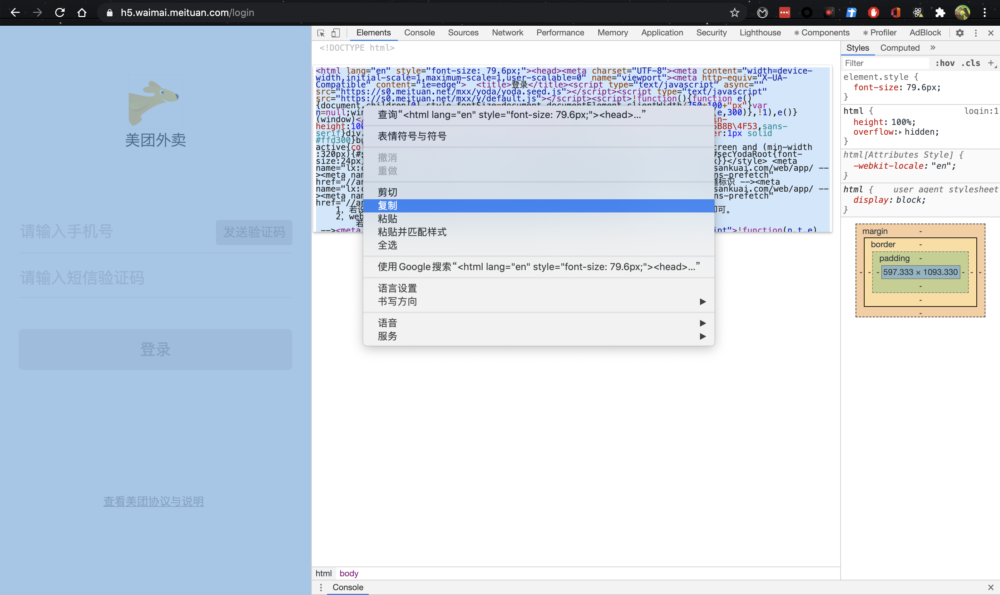

# Vueno

`.html`文件处理为`.vue`文件

# 贡献者

| [<br /><sub>Eno Yao</sub>](https://github.com/Wscats)| [<br /><sub>Aaron Xie</sub>](https://github.com/aaron-xie)| [<br /><sub>DK Lan</sub>](https://github.com/dk-lan)| <br /><sub>Xin</sub>| <br /><sub>Lemon</sub>  |  <br /><sub>Jing</sub>  |  <br /><sub>Lin</sub>  |
| - | - | - | - | - | - | - |

# 使用
在VSC中打开任何`.html`后缀文件，修改并保存，将自动转换为`.vue`的单文件组件

例如有文件`test.html`内容如下:
```html
<!DOCTYPE html>
<html lang="en">
<head>
    <meta charset="UTF-8">
    <meta name="viewport" content="width=device-width, initial-scale=1.0">
    <meta http-equiv="X-UA-Compatible" content="ie=edge">
    <title>Document</title>
    <style>
        div {
            color: red
        }
    </style>
</head>
<body>
    <script>
        console.log('Eno Yao')
    </script>
    <p>Eno Yao</p>
    <p>Hello World</p>
    <script>
        console.log('Hello World')
    </script>
</body>
</html>
```
保存文件后，将在同目录下生成`test.html.vue`文件，内容如下
```html
<template>
  <div>
    <p>Eno Yao</p>
    <p>Hello World</p>
  </div>
</template>
<script>
export default {};
</script>
<style scoped>
div {
  color: red;
}
</style>
```

例如：我们要仿造美团外卖的网站，你可以打开 https://h5.waimai.meituan.com/login 美团的官网，点击鼠标右键显示网页源代码复制到 `VS Code` 的 `.html` 格式文件中，然后保存就可以生成 `.vue` 后缀的文件了。

